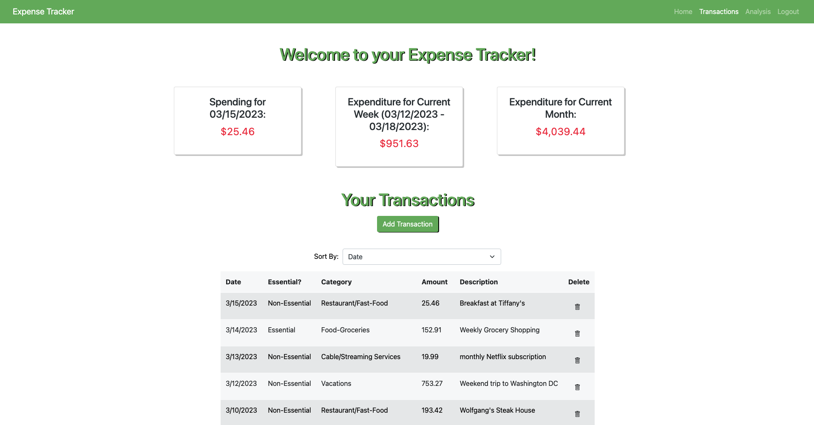
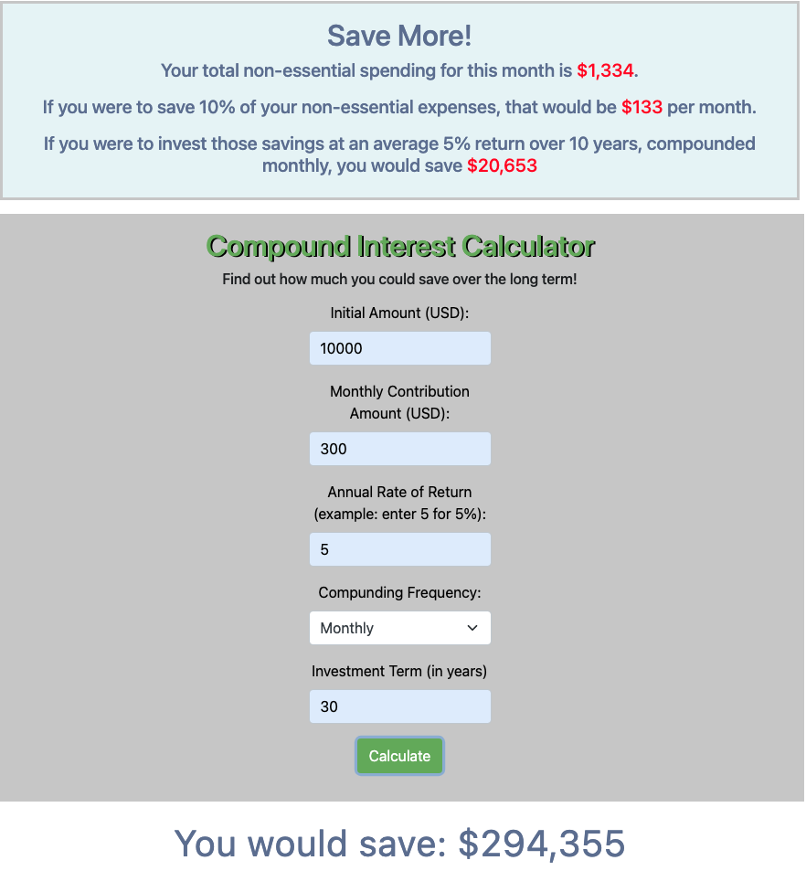
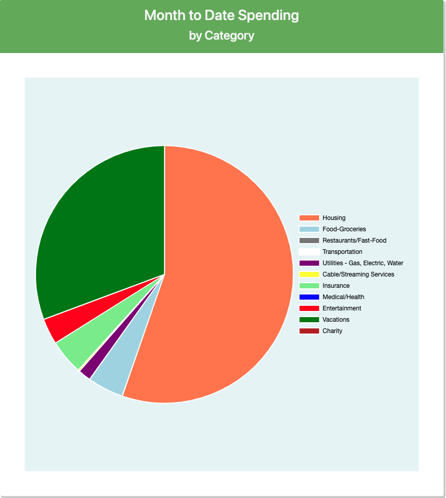

<<<<<<< HEAD
# Expensetracker
=======
# Expense-Tracker-MERN !

  ## Description

  Expense Tracker is a full stack MERN app which allows users to track their personal expenses. Upon sign in, a user can enter expense transactions and categorize them as essential vs non-essential and into various sub-categories (Housing, Food, Utilities, Entertainment, etc). Expenses are displayed by category into pie charts. The app also features a compound interest calculator so users can run scenarios where they might save a certain percentage of their non-essential expenses per month and see how much that translates into long term gains.

  Screenshots:

  
  
  
  

  
  ## Table of Contents
  
  - [Installation](#installation)
  - [Usage](#usage)
  
  ## Usage
  
  sign up/log in to deployed URL above

  

